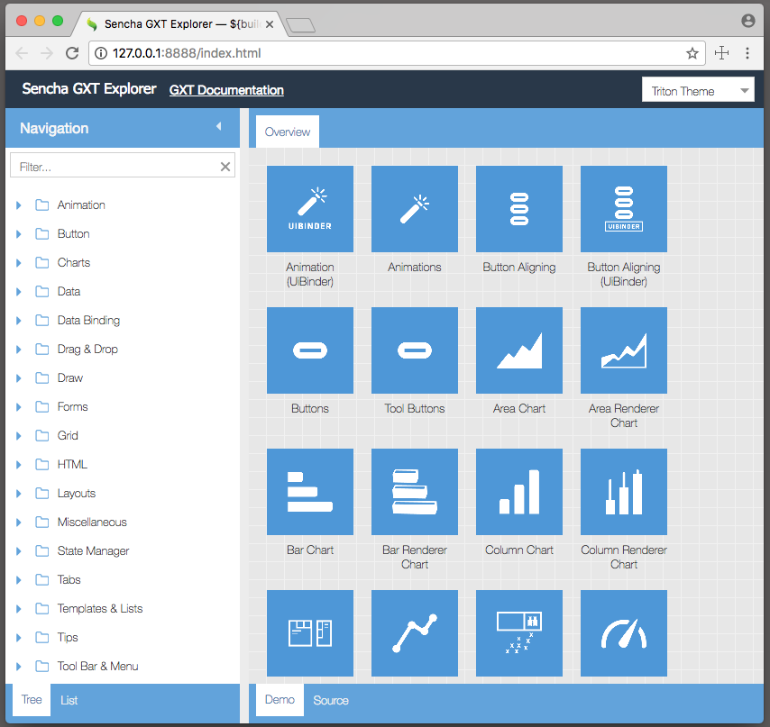

# GXT Examples Explorer

## GXT 

* [Sencha GXT Product Info](https://www.sencha.com/products/gxt/)
* [GXT Guides](http://docs.sencha.com/gxt/4.x/)

### Adding Ext JS Integration
Easily add Ext JS integration with the GWT JSNI or JsInterop Apis.

Integration instructions:
1. Download Ext JS zip. (In the near future it will be installed using Maven)
2. Import the resources into the [index.html](https://github.com/sencha/gxt-demo-explorer/blob/master/src/main/webapp/index.html). Find the Ext JS comments.
3. Add the resources to the [/extjs](https://github.com/sencha/gxt-demo-explorer/tree/master/src/main/webapp/extjs) directory. 

## Demo

* [Example Explorer Demo](http://examples.sencha.com/gxt/latest)

## Import

* Import the project as an existing maven project. 

## Debugging

### Debugging in Eclipse

1. Right click on the project and Debug As `GWT Development Mode with Jetty`
2. Double click on the url in the `Development Mode` web url.  
